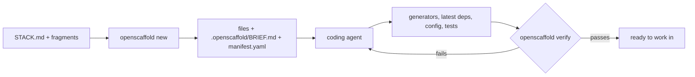

# openscaffold

Project scaffolding for the age of coding agents. openscaffold ships short, version-less recipes for dev stacks. Your coding agent (Claude Code, Codex, OpenCode, Cursor) turns a recipe into a working, tested dev environment built on whatever versions are current today.

```bash
npx openscaffold new python-react my-app
```

That command writes a few files and a brief, then hands off to your agent. The agent runs the official generators, installs the latest compatible dependencies, wires up tests, lint, CI and agent config, and keeps going until `openscaffold verify` passes.

## Why this exists

Template generators like Yeoman, cookiecutter, and the `create-*` family ship a snapshot of a project. The day a template is published, its versions start aging. Six months later, a new project starts life with outdated dependencies, deprecated config formats, and a migration guide to read before you've written any code. Maintainers spend their time bumping versions instead of improving the template.

Coding agents are good at exactly the part templates are bad at. They can read current docs, run `uv init` or `bun create vite`, notice that a config format changed, and fix things until the tests pass. What they lack is a well-defined target, so without one they make a different set of choices every time, skip the test setup, and forget the lint config.

openscaffold covers the part agents don't know. A stack says what the project is built from (FastAPI, React, vitest, Playwright, ruff), how it should be laid out, what the conventions are, and what "working" means as a list of commands that must pass. It never says which versions. The agent handles installing and configuring against today's ecosystem.

## When to reach for it

- You're starting a project and want the same well-tested setup you'd build by hand, without spending an afternoon on it.
- You're in a timed exercise, like a technical interview where AI help is allowed, and need a running dev environment with tests in a few minutes. Use `--sandbox`.
- You have a stack you rebuild often and want to write it down once, including the agent tooling (`.claude/` hooks, AGENTS.md), and reuse it.
- You want to add a known-good piece, such as agent config or CI, to a repo that already exists.

## Quick start

### Let your agent drive (recommended)

Ask your agent for what you want:

```text
Use npx openscaffold to set up a Python API with a React frontend in ./my-app.
```

The agent runs `openscaffold list --json`, picks a stack and explains why, runs `openscaffold new`, then reads the brief it gets back and builds the project. You can also describe the project instead of naming a stack ("a CLI in Go", "a blog I can deploy to Cloudflare"). The agent picks from the catalog.

To have agents find openscaffold without you mentioning it, install the skill:

```bash
npx skills add tryopendata/openscaffold
```

### Run it yourself

```bash
npx openscaffold list                        # see the stacks and fragments
npx openscaffold show python-react           # what a stack contains
npx openscaffold new python-react my-app     # scaffold, then launch your agent
```

Run from a terminal, `new` launches the first coding agent it finds on your PATH, with the brief as its first prompt. Run from inside an agent, it hands the brief back to that agent. With `--no-launch`, or when no agent is found, it prints the prompt to paste into whichever agent you use.

## How it works



1. openscaffold resolves the stack and its fragments, applying your `--with`, `--without` and preset choices.
2. It copies a small set of version-agnostic files (AGENTS.md skeleton, agent hooks, `.gitignore`, a Makefile to start from), runs `git init`, and writes two things into `.openscaffold/`:
   - `BRIEF.md` is the full task for the agent: the stack's guidance, every fragment's guidance, the decisions to confirm with you, and the definition of done.
   - `manifest.yaml` records what was composed and the verify steps.
3. The agent does the rest. It picks current versions, runs generators, writes tool config for the versions it installed, fills in AGENTS.md from the real commands, and loops on `openscaffold verify` until everything is green.

The CLI never calls an LLM, and `new`/`add` never run commands defined by a stack. The only command execution is `verify`, which runs the steps in your project's `manifest.yaml` and prints each one first.

## Stacks

| Stack | What you get |
|---|---|
| `python-react` | FastAPI + uv + ruff + mypy + pytest backend, React + Vite + React Router + TanStack Query + Tailwind/shadcn frontend, typed API client generated from OpenAPI, vitest + Playwright |
| `go-cli` | Go CLI with cobra + viper, structured errors, testify, golangci-lint, race-checked tests with a coverage gate |
| `astro-blog` | Static Astro site with MDX content collections, React islands, Tailwind, sitemap and RSS, vitest + `astro check` |

More are on the [roadmap](docs/roadmap.md): an MCP server, Slidev decks, an Expo mobile app with a Hono API, a fullstack TypeScript monorepo, and a Claude plugin marketplace.

## Fragments

Fragments are the reusable pieces a stack is composed from. Each stack turns some on by default, and you can add or remove any of them:

```bash
npx openscaffold new python-react my-app --with postgres,docker-deploy --without posthog
```

| Fragment | Category | Adds |
|---|---|---|
| `agent-ops` | agent-ops | AGENTS.md, plus Claude Code config: destructive-command guard, secret detection, lint on write, session context |
| `ce-plugin` | agent-ops | The [claude-essentials](https://github.com/rileyhilliard/claude-essentials) plugin and path-scoped rules that load its skills |
| `git-hooks` | tooling | lefthook with format/lint on commit, conventional commit messages, tests on push |
| `rr` | tooling | Remote test execution with [rr](https://github.com/rileyhilliard/rr) |
| `ci-github` | ci | GitHub Actions for lint, typecheck, test and build |
| `posthog` | vendor | PostHog analytics, off when no key is set |
| `postgres` | service | Postgres in Docker Compose with a separate test database and migrations |
| `docker-deploy` | deploy | Multi-stage images published to GHCR |
| `goreleaser` | release | Cross-platform release builds for Go binaries |
| `cloudflare-pages` | deploy | Static deploys to Cloudflare Pages |

Two fragments can't write the same file. Where several need the same config (for example `.claude/settings.json`), they declare it as mergeable and openscaffold deep-merges the JSON.

## Sandbox mode

```bash
npx openscaffold new python-react scratch --sandbox
```

`--sandbox` is for "I just want a dev environment running." It uses every default without asking, drops deploy and release fragments, and skips production-only verify steps like image builds. The agent is told to optimize for time to green.

## Existing repos

`add` applies fragments to a repo you already have:

```bash
npx openscaffold add agent-ops ci-github
```

It never overwrites a file. Anything that already exists is listed in the brief as "merge needed," and the agent reconciles it with what's there. If the repo wasn't created by openscaffold, `add` creates a manifest so `verify` works from then on.

## Verify

```bash
npx openscaffold verify
```

Each stack and fragment declares the steps that prove the project works: install, lint, typecheck, test, build, and dev servers that must answer an HTTP probe. `verify` runs them in phases (setup, check, serve, teardown), kills anything it started, and exits non-zero on any failure. The brief tells the agent that weakening a step to make it pass counts as a failure, and `verify` warns when the steps in `manifest.yaml` no longer match what openscaffold generated.

Useful flags: `--json` for machine-readable output, `--only test`, `--skip-tag prod`, and `--all` to include steps a sandbox project skips.

## Your own stacks

Stacks and fragments resolve from four places, highest precedence first:

| Location | Use it for |
|---|---|
| `./.openscaffold/{stacks,fragments}/` | Entries specific to one repo |
| `~/.openscaffold/{stacks,fragments}/` | Your personal stacks, and overrides of built-in ones |
| The main registry on GitHub | Community stacks, fetched and cached for 24h, so new stacks don't need a CLI release |
| The copy bundled in the npm package | Offline fallback |

Personal defaults go in `~/.openscaffold/config.yaml`:

```yaml
always: [rr, ce-plugin]       # added to every new project unless --without'd
agents: [claude, codex]       # agent configs to generate
author: Your Name
package_scope: "@yourorg"
preset: default               # or sandbox
```

A stack is a directory with a `STACK.md` (YAML frontmatter plus guidance for the agent) and optional `files/` and `adapters/<agent>/`. See [docs/format.md](docs/format.md) for the full format and [docs/authoring.md](docs/authoring.md) for how to write a good one. Run `openscaffold validate <dir>` while you work on it.

## Contributing a stack

Stacks in the main registry live in [`registry/`](registry/). Open a PR with your stack or fragment and make sure `npx openscaffold validate registry` passes. A good stack:

- names dependencies without versions, grouped by role;
- describes tool config as intent ("enable strict mode and these lint rules") instead of shipping config files that break on the next major release;
- has verify steps that call project commands (`make test`), including a dev server probe;
- has been run end to end at least once: `openscaffold new <your-stack> --sandbox` with a real agent, until `verify` goes green.

## Agent support

| Agent | Instructions | Native config |
|---|---|---|
| Claude Code | AGENTS.md, imported from CLAUDE.md | `.claude/` settings, hooks and rules |
| Codex | AGENTS.md | Planned |
| OpenCode | AGENTS.md | Planned |
| Cursor | AGENTS.md | Planned |

AGENTS.md is the canonical instruction file, so every agent gets the project guidance. The `adapters/` mechanism is how per-agent config is added as each agent's native formats are covered.

## Commands

| Command | What it does |
|---|---|
| `openscaffold` | Prints a guide written for agents |
| `list [--kind stack\|fragment] [--json]` | Lists available stacks and fragments with where each came from |
| `show <id> [--json]` | Shows a stack or fragment's metadata, guidance, and files |
| `new <stack> [dir]` | Scaffolds a project and hands off to an agent. Flags: `--with`, `--without`, `--sandbox`, `--yes`, `--agents`, `--agent`, `--no-launch`, `--json` |
| `add <fragment...>` | Applies fragments to an existing repo |
| `verify` | Runs the project's verify steps |
| `validate <path>` | Checks a stack, fragment, or registry directory |

## Status

Early. The format and CLI are v0 and may change. The [roadmap](docs/roadmap.md) tracks what's next.

## License

MIT
